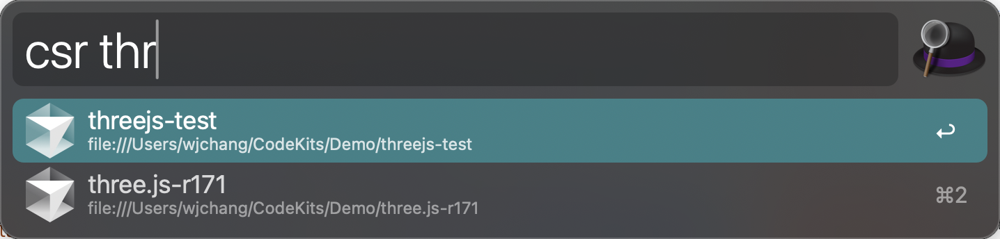

# Alfred 4/5 Cursor 工作区流水线

在 Alfred 中获取您的 Cursor 工作区列表

- 在 Alfred 中输入 `csr` 获取列表
- 支持**本地**和**远程**工作区



基于 https://github.com/phartenfeller/alfred-vscode-workspaces 进行修改


## 安装

您需要将 `cursor` 添加到系统路径中：cmd + p


您需要一个[当前维护的 Node.js 版本](https://nodejs.org/en/about/previous-releases)。

```bash
npm install --global @changwj/alfred-vscode-workspaces
``` 
